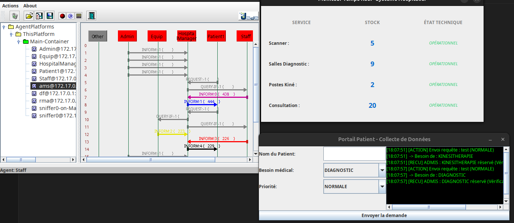

# Gestion Sanitaire SMA - Système de Gestion d'Information Hospitalier

Ce projet est une application de gestion hospitalière basée sur un **Système Multi-Agents (SMA)** utilisant le framework **JADE** (Java Agent DEvelopment Framework). Il simule un environnement de soins de santé intelligent où différents agents collaborent pour gérer les ressources, le personnel et les admissions des patients en temps réel.

## 🏥 Architecture du Système

Le projet repose sur plusieurs agents spécialisés qui communiquent par échange de messages ACL :

* **HospitalAgent (HospitalManager)** : Le cœur du système. Il gère les stocks de ressources (Scanners, Salles de diagnostic, etc.), coordonne les vérifications techniques et prend la décision finale d'admission.
* **PatientAgent** : Permet aux patients de soumettre des demandes de soins (nom, besoin médical et priorité) via une interface dédiée.
* **AdminAgent** : Assure la supervision du système et diffuse périodiquement des rapports sur l'état du réseau et des flux.
* **EquipmentAgent** : Surveille l'état technique du matériel médical pour s'assurer que les équipements sont opérationnels.
* **StaffAgent** : Gère la disponibilité des ressources humaines (médecins, personnel soignant).

## ✨ Fonctionnalités Clés

* **Vérification Dynamique** : Avant chaque admission, le système interroge les agents *Staff* et *Equip* pour valider la faisabilité technique et humaine de l'acte médical.
* **Gestion des Priorités** : Le système gère les demandes "URGENTES" et "NORMALES", adaptant l'attribution des ressources en fonction de la criticité.
* **Moniteur Temps Réel** : Une interface graphique centralisée permet de suivre les niveaux de stock pour chaque service et leur état de fonctionnement.
* **Historisation** : Toutes les admissions validées sont automatiquement enregistrées dans un fichier `historique_hopital.csv` pour assurer la traçabilité.

## 📸 Aperçu de l'Interface

Voici une capture d'écran du système en fonctionnement, montrant le moniteur de l'hôpital, le portail patient et le suivi des messages entre agents :



## 🛠️ Technologies Utilisées

* **Langage** : Java 11.
* **Framework SMA** : JADE 4.6.0.
* **Gestion de projet** : Maven.
* **Interface Graphique** : Java Swing.

## 🚀 Installation et Lancement

1.  **Prérequis** : Java 11 et Maven installés.
2.  **Compilation** :
    ```bash
    mvn clean install
    ```
3.  **Exécution** : Lancez la plateforme JADE et déployez les agents situés dans le package `dz.univ.hadj`.

---
*Projet développé pour le module SMI - Gestion de Systèmes d'Information et Technologies.*
